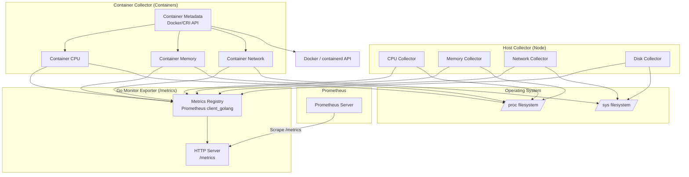
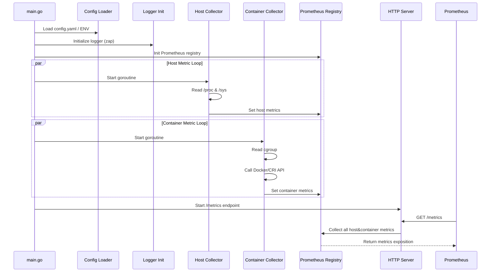
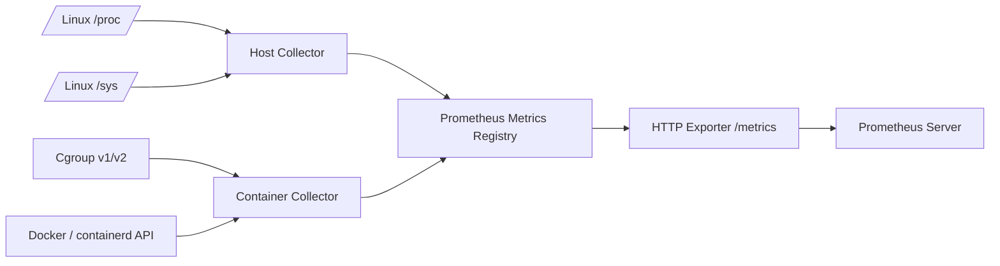

### **功能特性以及模块设计**
+ (A) Host（Node）采集器
  + 指标类型： 
    + CPU：核数、使用率、负载（load average） 
    + 内存：总量、已用、可用 
    + 磁盘：总量、使用量、IO 
    + 网络：流量（tx/rx）、错误包 
  + 实现方式： 
    + 读取 /proc/stat、/proc/meminfo、/proc/diskstats、/sys/class/net/*
    + 定时采集（如 5 秒一次） 
    + 使用 client_golang 注册指标

+ (B) Container 采集器 
  + 指标类型： 
    + CPU/内存使用率（容器限额 vs 实际） 
    + 网络流量 
    + 容器状态（Running / Paused / Stopped） 
  + 实现方式： 
    + 读取 cgroup v1/v2 文件 
    + Docker/CRI API 获取容器元数据 
    + 支持多容器循环采集
+ 扩展： 
  + 支持 Kubernetes Pod Label 解析（可选，面试亮点）

+ (C) Metric Exporter 
  + HTTP 服务暴露 /metrics，Prometheus 拉取 
    + 支持 Label： 
    + host=<hostname>
    + container=<name/id>
    + namespace=<k8s namespace>（可选） 
    + 支持采集间隔配置

+ (D) 日志与异常监控 
  + 采集失败日志（文件/标准输出） 
  + 可选打印指标快照，便于 demo 展示 
  + 后期可扩展成 AlertManager 测试


### 总体架构图（Architecture Diagram – Mermaid）


### 调用流程图（Sequence Diagram – mermaid）


### 数据管线（Data Pipeline）图（Mermaid）


### **工程结构**
```text
cmd/monitor       # 程序入口
pkg/collector     # Host + Container指标采集
pkg/config        # 配置管理
pkg/logger        # 日志
internal/version  # 程序版本信息
deployments/      # Docker/K8s部署
configs/          # 默认配置
scripts/          # 启动脚本
```

### 技术可行性
+ Node Exporter：本质是一个采集器，它直接从 /proc、/sys、/etc 读取系统指标，然后暴露给 Prometheus。自研的话，你需要实现：
  + CPU、内存、磁盘、网络、文件系统、进程等指标采集 
  + 高效数据暴露接口（如 HTTP /metrics） 
  + 支持标签/实例信息

+ cAdvisor：主要采集容器相关指标，需要： 
  + 访问 cgroups（v1/v2）信息 
  + 处理容器生命周期、限制、CPU/mem usage 
  + 支持 Docker 或 CRI 运行时接口 
  + 支持多容器、多命名空间指标聚合

+ 语言选择上：Go 是首选（因为 Prometheus client 库成熟，且 cAdvisor 原生就是 Go）。

### 难点

#### 1. 权限问题
+ Node 采集需要 root 或高权限访问 /proc
+ 容器采集需要访问 cgroup 和容器运行时 API

#### 2. 跨平台兼容性
+ Linux 内核版本不同，cgroup v1/v2 差异大
+ Docker、containerd、CRI-O API 不完全一致

#### 3. 高性能与稳定性
+ Node Exporter/cAdvisor 都经过多年优化，尤其在高密度容器节点上
+ 自研需要保证低资源占用、不阻塞宿主机

#### 4. 维护成本
+ 系统升级、内核变化、容器运行时更新都可能导致指标采集异常
+ 需要不断跟进开源工具更新

#### 3. 优势
+ 可定制指标：比如公司自定义硬件或业务指标
+ 轻量化：去掉不需要的指标，减少开销
+ 统一采集器：Node + 容器指标在一个程序中，便于部署和管理

### 实践建议
+ 可以 参考 Node Exporter + cAdvisor 源码，先做一个“最小可行版本”，只采集最核心指标 使用 Go + Prometheus client_golang，HTTP 暴露 /metrics
+ 分层设计：
    + Host level collector
    + Container level collector
    + Metric registry & HTTP exporter
+ 后期可扩展到 集群模式，像 kube-state-metrics 一样提供额外维度


### 工程目录结构
```plantuml
agent-collector/
├── cmd/
│   └── monitor/
│       └── main.go          # 程序入口
├── pkg/
│   ├── collector/
│   │   ├── host.go          # Node指标采集
│   │   ├── container.go     # 容器指标采集
│   │   └── metrics.go       # Prometheus指标注册与导出
│   ├── config/
│   │   └── config.go        # 配置管理（文件/环境变量）
│   ├── logger/
│   │   └── logger.go        # 日志初始化（zap/logrus）
│   └── utils/
│       └── helpers.go       # 辅助方法（获取hostname、解析cgroup等）
├── internal/
│   └── version/
│       └── version.go       # 程序版本信息
├── deployments/
│   ├── docker/
│   │   └── Dockerfile       # Docker镜像构建
│   └── k8s/
│       └── daemonset.yaml   # Kubernetes DaemonSet部署示例
├── configs/
│   └── config.yaml          # 默认配置文件
├── scripts/
│   └── run_local.sh         # 本地快速启动脚本
├── go.mod
├── go.sum
└── README.md
```