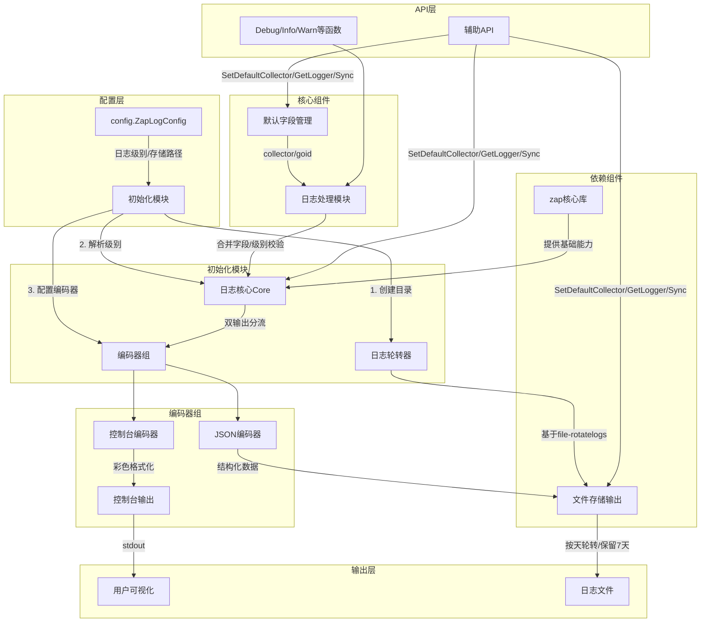
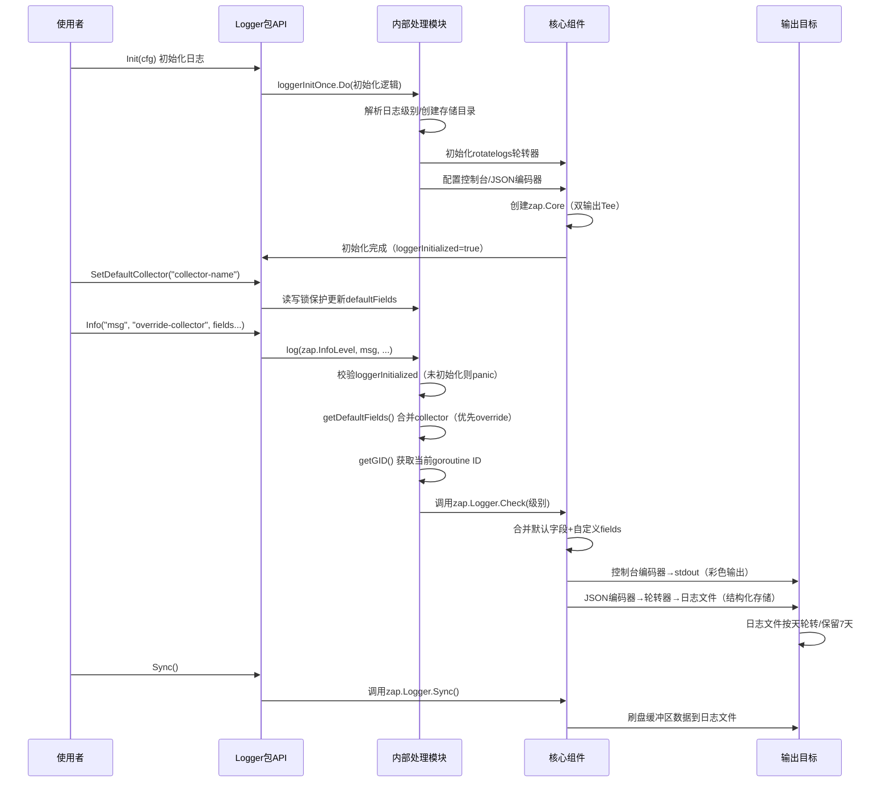

<!-- gomarkdoc:embed:start -->

<!-- Code generated by gomarkdoc. DO NOT EDIT -->

# logger

```go
import "github.com/agent-collector/util/logger"
```

logger包基于zap和file\-rotatelogs实现高性能日志工具，支持以下核心特性：
1. 双输出目标：控制台彩色格式化输出 \+ 文件JSON格式持久化 
2. 日志轮转：按天自动轮转日志文件，保留7天历史日志 
3. 级别过滤：支持debug/info/warn/error/panic/fatal六级日志过滤 
4. 默认字段：自动注入collector（可覆盖）和goroutine ID字段 
5. 增强可读性：控制台输出带颜色区分（时间蓝/级别多色/调用者精简路径） 
6. 线程安全：默认字段读写通过读写锁保护，支持并发场景 
7. 调试友好：错误级别日志自动附加堆栈信息，调用者信息包含文件路径\+行号


# 组件组成与依赖


# 核心调用关系图（用户使用流程）

> 图注说明
>> 架构图核心逻辑：分层设计解耦，配置层驱动初始化，核心组件负责日志处理，输出层支持双目标存储，API 层提供简洁调用入口。
> 
>> 调用关系关键节点：初始化仅执行一次（sync.Once），默认字段读写线程安全（RWMutex），日志输出需先通过级别校验（Check）再写入。

使用规范： 
 1. 程序启动时必须先调用Init\(\)初始化，传入日志配置 
 2. 可通过SetDefaultCollector\(\)设置全局默认collector字段 
 3. 日志输出优先使用包暴露的Debug/Info/Warn等方法，支持临时覆盖collector 
 4. 程序退出前建议调用Sync\(\)确保日志缓冲区数据刷盘

## Index

- [func Debug\(msg string, collectorOverride string, fields ...zapcore.Field\)](<#Debug>)
- [func Error\(msg string, collectorOverride string, fields ...zapcore.Field\)](<#Error>)
- [func Fatal\(msg string, collectorOverride string, fields ...zapcore.Field\)](<#Fatal>)
- [func GetDefaultCollector\(\) string](<#GetDefaultCollector>)
- [func GetLogger\(\) \*zap.Logger](<#GetLogger>)
- [func Info\(msg string, collectorOverride string, fields ...zapcore.Field\)](<#Info>)
- [func Init\(cfg config.ZapLogConfig\) error](<#Init>)
- [func Panic\(msg string, collectorOverride string, fields ...zapcore.Field\)](<#Panic>)
- [func SetDefaultCollector\(collector string\)](<#SetDefaultCollector>)
- [func Sync\(\) error](<#Sync>)
- [func Warn\(msg string, collectorOverride string, fields ...zapcore.Field\)](<#Warn>)
- [type Logger](<#Logger>)


<a name="Debug"></a>
## func [Debug](<https://github.com/SketcOnly/agent-collector/blob/main/pkg/logger/logger.go#L264>)

```go
func Debug(msg string, collectorOverride string, fields ...zapcore.Field)
```

Debug 输出Debug级别日志（最低级别，用于调试细节） 参数msg：日志消息内容 参数collectorOverride：可选，临时覆盖当前日志的collector字段（为空则使用全局默认） 参数fields：额外的自定义日志字段（支持zap提供的所有字段类型）

<a name="Error"></a>
## func [Error](<https://github.com/SketcOnly/agent-collector/blob/main/pkg/logger/logger.go#L288>)

```go
func Error(msg string, collectorOverride string, fields ...zapcore.Field)
```

Error 输出Error级别日志（错误信息，如业务异常、功能执行失败，会附加堆栈信息） 参数msg：日志消息内容 参数collectorOverride：可选，临时覆盖当前日志的collector字段（为空则使用全局默认） 参数fields：额外的自定义日志字段（支持zap提供的所有字段类型）

<a name="Fatal"></a>
## func [Fatal](<https://github.com/SketcOnly/agent-collector/blob/main/pkg/logger/logger.go#L304>)

```go
func Fatal(msg string, collectorOverride string, fields ...zapcore.Field)
```

Fatal 输出Fatal级别日志（致命错误，输出后会调用os.Exit\(1\)终止程序） 参数msg：日志消息内容 参数collectorOverride：可选，临时覆盖当前日志的collector字段（为空则使用全局默认） 参数fields：额外的自定义日志字段（支持zap提供的所有字段类型）

<a name="GetDefaultCollector"></a>
## func [GetDefaultCollector](<https://github.com/SketcOnly/agent-collector/blob/main/pkg/logger/logger.go#L172>)

```go
func GetDefaultCollector() string
```

GetDefaultCollector 获取当前全局默认的collector字段值（线程安全） 返回值：当前设置的默认采集器名称（未设置时为空字符串）

<a name="GetLogger"></a>
## func [GetLogger](<https://github.com/SketcOnly/agent-collector/blob/main/pkg/logger/logger.go#L322>)

```go
func GetLogger() *zap.Logger
```

GetLogger 获取基础的zap.Logger实例（包含默认配置和字段） 适用于需要直接使用zap原生API的场景（如自定义日志输出逻辑） 注意：未初始化时调用会panic，需确保先执行Init\(\) 返回值：初始化后的zap.Logger核心实例

<a name="Info"></a>
## func [Info](<https://github.com/SketcOnly/agent-collector/blob/main/pkg/logger/logger.go#L272>)

```go
func Info(msg string, collectorOverride string, fields ...zapcore.Field)
```

Info 输出Info级别日志（普通运行信息，如服务启动、关键流程执行） 参数msg：日志消息内容 参数collectorOverride：可选，临时覆盖当前日志的collector字段（为空则使用全局默认） 参数fields：额外的自定义日志字段（支持zap提供的所有字段类型）

<a name="Init"></a>
## func [Init](<https://github.com/SketcOnly/agent-collector/blob/main/pkg/logger/logger.go#L55>)

```go
func Init(cfg config.ZapLogConfig) error
```

Init 初始化日志系统，必须在使用任何日志方法前调用（建议程序启动时执行） 参数cfg：日志配置结构体，包含日志级别、存储路径等核心配置 返回值：初始化过程中产生的错误（如目录创建失败、日志轮转器初始化失败等）

<a name="Panic"></a>
## func [Panic](<https://github.com/SketcOnly/agent-collector/blob/main/pkg/logger/logger.go#L296>)

```go
func Panic(msg string, collectorOverride string, fields ...zapcore.Field)
```

Panic 输出Panic级别日志（严重错误，输出后会触发panic） 参数msg：日志消息内容 参数collectorOverride：可选，临时覆盖当前日志的collector字段（为空则使用全局默认） 参数fields：额外的自定义日志字段（支持zap提供的所有字段类型）

<a name="SetDefaultCollector"></a>
## func [SetDefaultCollector](<https://github.com/SketcOnly/agent-collector/blob/main/pkg/logger/logger.go#L164>)

```go
func SetDefaultCollector(collector string)
```

SetDefaultCollector 设置全局默认的collector字段值（线程安全） 适用于整个应用统一使用同一个采集器标识的场景，后续日志会自动携带该字段 参数collector：要设置的采集器名称（如"metrics\-collector"、"log\-collector"）

<a name="Sync"></a>
## func [Sync](<https://github.com/SketcOnly/agent-collector/blob/main/pkg/logger/logger.go#L311>)

```go
func Sync() error
```

Sync 同步日志缓冲区，确保所有待写入的日志数据都持久化到存储介质（文件/控制台） 建议在程序退出前调用（如main函数结束时），避免日志丢失 返回值：同步过程中产生的错误（如文件写入失败）

<a name="Warn"></a>
## func [Warn](<https://github.com/SketcOnly/agent-collector/blob/main/pkg/logger/logger.go#L280>)

```go
func Warn(msg string, collectorOverride string, fields ...zapcore.Field)
```

Warn 输出Warn级别日志（警告信息，如非致命错误、异常但不影响运行的场景） 参数msg：日志消息内容 参数collectorOverride：可选，临时覆盖当前日志的collector字段（为空则使用全局默认） 参数fields：额外的自定义日志字段（支持zap提供的所有字段类型）

<a name="Logger"></a>
## type [Logger](<https://github.com/SketcOnly/agent-collector/blob/main/pkg/logger/logger.go#L35>)

Logger 是zap.Logger的类型别名，简化外部包对日志核心类型的引用

```go
type Logger = zap.Logger
```

Generated by [gomarkdoc](<https://github.com/princjef/gomarkdoc>)


<!-- gomarkdoc:embed:end -->